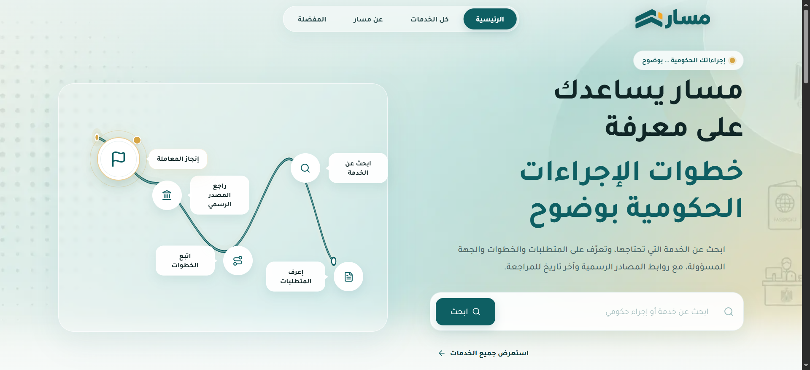
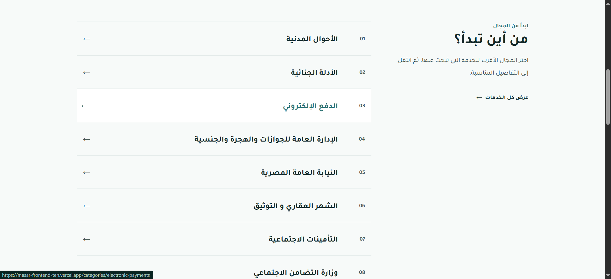
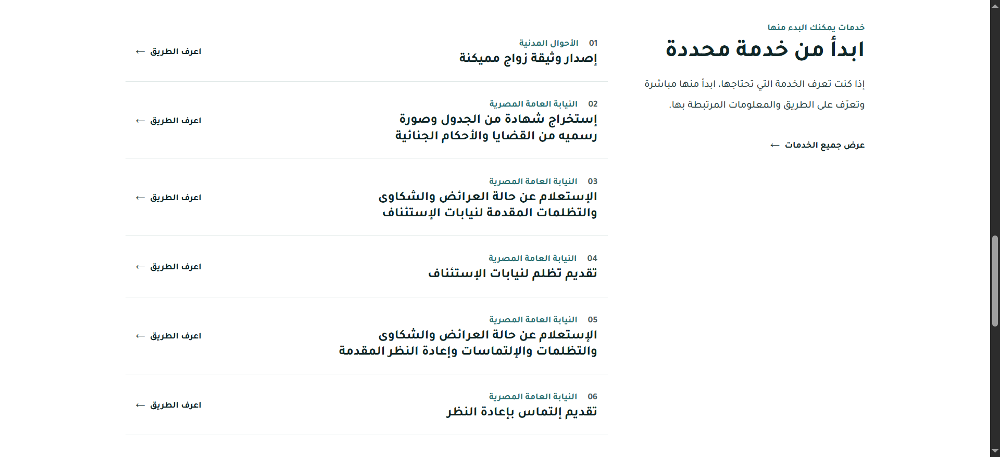
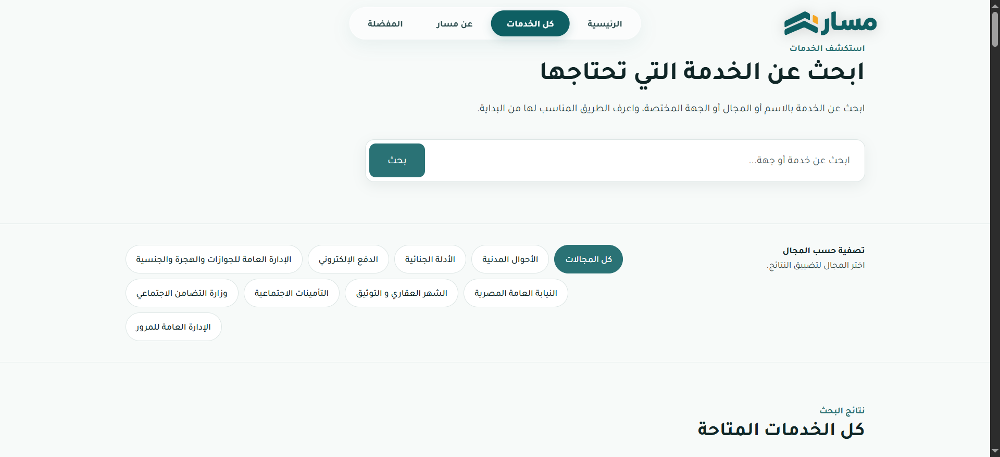
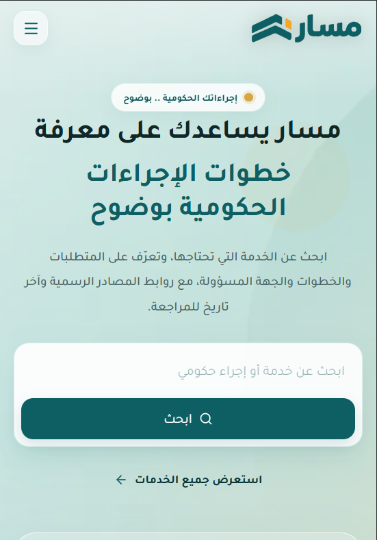

# 🇪🇬 Masar — مسار

### دليل مبسّط للإجراءات الحكومية

**Masar** is an Arabic-first web platform designed to simplify discovering and navigating government services in Egypt.

The platform provides a structured way to browse, search, filter, and explore government services through a modern, responsive Arabic RTL interface.

<br />

[](https://masar-frontend-ten.vercel.app/)
[](https://nextjs.org/)
[](https://react.dev/)
[](https://www.typescriptlang.org/)
[](https://strapi.io/)
[](https://www.postgresql.org/)

---

## 📸 Preview

<!-- Replace the path below with your screenshot -->

<p align="center">
  
</p>

---

## 🔗 Live Demo

### 🌐 [Visit Masar](https://masar-frontend-ten.vercel.app/)

> The production frontend is deployed separately from the Strapi backend.

---

# 🎯 About The Project

Masar was built to solve a simple problem:

> **Government procedures can be difficult to discover, understand, and navigate.**

The goal of Masar is to provide a cleaner and more accessible experience where users can discover government services from a single platform.

Users can:

- Browse government services.
- Search for a specific service.
- Filter services by category.
- Open detailed service pages.
- Save services to Favorites.
- Use the platform comfortably in Arabic RTL.

---

# ✨ Features

## 🔎 Service Search

Users can search through the available government services and quickly find what they need.

---

## 🗂️ Categories & Filtering

Services are organized into categories, allowing users to narrow down the results and discover related services.

---

## 📄 Service Details

Each service has a dedicated page containing its relevant information.

---

## ❤️ Favorites

Users can save services they are interested in and access them later through the Favorites section.

---

## 🇪🇬 Arabic RTL

The entire interface was designed specifically for Arabic users.

The application supports:

- Arabic typography
- RTL layout
- RTL navigation
- Arabic-friendly spacing
- Arabic-first content structure

---

## 📱 Responsive Design

The interface is designed to work across:

- 📱 Mobile
- 📲 Tablet
- 💻 Laptop
- 🖥️ Desktop

---

# 🛠️ Tech Stack

## Frontend

| Technology           | Purpose                |
| -------------------- | ---------------------- |
| Next.js              | React framework        |
| React                | UI development         |
| TypeScript           | Type safety            |
| Tailwind CSS         | Styling                |
| shadcn/ui            | Reusable UI components |
| IBM Plex Sans Arabic | Arabic typography      |

## Backend

| Technology | Purpose                          |
| ---------- | -------------------------------- |
| Strapi     | Headless CMS                     |
| Node.js    | Backend runtime                  |
| REST API   | Frontend ↔ Backend communication |

## Database

| Technology | Purpose              |
| ---------- | -------------------- |
| PostgreSQL | Application database |

## Development & Deployment

| Tool          | Purpose                   |
| ------------- | ------------------------- |
| Git           | Version control           |
| GitHub        | Source code hosting       |
| Vercel        | Frontend deployment       |
| Cloud Hosting | Strapi backend deployment |

---

# 🏗️ Architecture

Masar follows a separated frontend/backend architecture.

```text
                         ┌───────────────┐
                         │     User      │
                         └───────┬───────┘
                                 │
                                 ▼
                     ┌─────────────────────┐
                     │      Next.js        │
                     │   React Frontend    │
                     └──────────┬──────────┘
                                │
                                │ REST API
                                ▼
                     ┌─────────────────────┐
                     │       Strapi        │
                     │     Headless CMS     │
                     └──────────┬──────────┘
                                │
                                ▼
                     ┌─────────────────────┐
                     │     PostgreSQL      │
                     │      Database       │
                     └─────────────────────┘
```

The frontend never communicates directly with PostgreSQL.

Instead, Strapi manages the application data and exposes it through its REST API.

---

# 🔄 Data Flow

The main data flow is:

```text
Next.js
   │
   │ HTTP Request
   ▼
Strapi REST API
   │
   ▼
PostgreSQL
   │
   ▼
Strapi Response
   │
   ▼
Frontend Data Layer
   │
   ▼
React Components
```

This keeps the UI separated from the database and CMS implementation.

---

# 📦 Content Model

The main content types are:

## Category

Represents a government service category.

Example structure:

```text
Category
├── name
├── slug
└── services
```

---

## Service

Represents an individual government service.

Example structure:

```text
Service
├── title
├── slug
├── description
├── ...
└── category
```

---

## 🔗 Relationships

Services are connected to categories through a relationship:

```text
Category 1
   │
   ├── Service
   ├── Service
   ├── Service
   └── Service
```

The production catalogue contains:

- **9 categories**
- **130 services**

---

# 🧩 Frontend Structure

The frontend is built using reusable React components.

The application separates reusable UI elements from page-level logic.

Examples include:

```text
components/
├── layout/
│   ├── header
│   └── footer
│
├── home/
│   ├── hero
│   └── ...
│
├── services/
│   ├── service-card
│   ├── service-details
│   └── ...
│
└── ui/
    └── reusable components
```

> The exact folder structure may evolve as the project grows.

---

# 🎨 Design System

Masar uses a modern visual identity focused on clarity and accessibility.

### Primary Color

```text
#0E5F63
```

### Supporting Colors

```text
#0B4F52
#B8DFDC
#F4FAF9
#9B642E
#0F1A18
```

### Typography

**IBM Plex Sans Arabic**

The design was created with Arabic readability and RTL layouts in mind.

---

# 🖼️ Screenshots

Add your screenshots to:

```text
docs/
└── images/
    ├── homepage.png
    ├── services.png
    ├── service-details.png
    ├── search.png
    └── mobile.png
```

Then use them like this:

## Homepage

<p align="center">
  
</p>

---

## Services

<p align="center">
  
</p>

---

## Service Details

<p align="center">
  
</p>

---

## Search & Filtering

<p align="center">
  
</p>

---

## Mobile

<p align="center">
  
</p>

---

# 🚀 Getting Started

## Prerequisites

Make sure you have:

- Node.js
- npm
- Git

installed on your machine.

---

## 1. Clone the Repository

```bash
git clone https://github.com/AmgadBadawy/masar-frontend.git
```

Then:

```bash
cd masar-frontend
```

---

## 2. Install Dependencies

```bash
npm install
```

---

## 3. Environment Variables

Create a `.env.local` file in the project root:

```env
STRAPI_URL=your-strapi-backend-url
```

The frontend uses this variable to communicate with the Strapi backend.

> Never commit sensitive credentials, API tokens, or secrets to GitHub.

---

## 4. Run the Development Server

```bash
npm run dev
```

Open:

```text
http://localhost:3000
```

---

# 🔐 Environment Configuration

External configuration is handled through environment variables.

Example:

```env
STRAPI_URL=
```

Sensitive values should remain outside the source code and should never be committed to the repository.

---

# 🚀 Deployment

## Frontend

The Next.js frontend is deployed using Vercel.

```text
GitHub
   │
   ▼
Vercel
   │
   ▼
Next.js Production App
```

---

## Backend

The Strapi backend is deployed separately.

```text
Strapi
   │
   ▼
PostgreSQL
```

This separation allows the frontend and backend to be deployed and maintained independently.

---

# 🧪 Production Challenge

One of the main challenges during deployment involved the relationship between:

```text
Service ↔ Category
```

The services and categories were transferred to the remote Strapi environment, but some relationships were not preserved correctly.

This caused the frontend data mapping to fail because it expected the `category` field to be an object.

### Diagnosis

The local and remote environments were compared using Strapi `documentId` values.

The comparison confirmed:

```text
Local Services:    130
Remote Services:   130
Matched:           130
Missing:             0
```

The problem was not missing services or categories.

The problem was the missing relationship data.

---

# 🔧 How It Was Fixed

A custom Node.js repair script was created to restore the relationships.

The script:

1. Retrieved local services.
2. Retrieved remote services.
3. Matched services using `documentId`.
4. Identified the correct category.
5. Updated the remote Service → Category relationship.
6. Verified the result through the Strapi API.

After the repair, all production services were correctly associated with their categories.

---

# 🧠 What I Learned

Building Masar provided practical experience with the complete lifecycle of a full-stack application.

### Frontend

- React component architecture
- Next.js
- TypeScript
- Responsive UI
- Arabic RTL design

### Backend

- Strapi
- REST APIs
- Content modeling
- Relationships
- CMS management

### Data

- PostgreSQL
- Data relationships
- Data migration
- Production data verification

### Deployment

- Git
- GitHub
- Vercel
- Environment variables
- Production debugging

---

# 📈 Future Improvements

Potential improvements for future versions include:

- Advanced service search
- More detailed service information
- Better personalization
- User accounts
- Improved favorites synchronization
- Additional government service categories
- Performance optimizations
- Enhanced SEO
- More accessibility improvements

---

# 🔗 Project Links

### 🌐 Live Demo

**[Open Masar](https://masar-frontend-ten.vercel.app/)**

### 💻 Frontend Repository

**[GitHub — Masar Frontend](https://github.com/AmgadBadawy/masar-frontend)**

### ⚙️ Backend

The backend is maintained separately using Strapi.

---

# 👨‍💻 Author

## Amgad Badawy

Computer Science / Information Technology Graduate

Interested in building modern web applications with React, Next.js, TypeScript, and full-stack technologies.

---

<p align="center">
  Built with ❤️ using Next.js, React, TypeScript, Strapi & PostgreSQL
</p>
